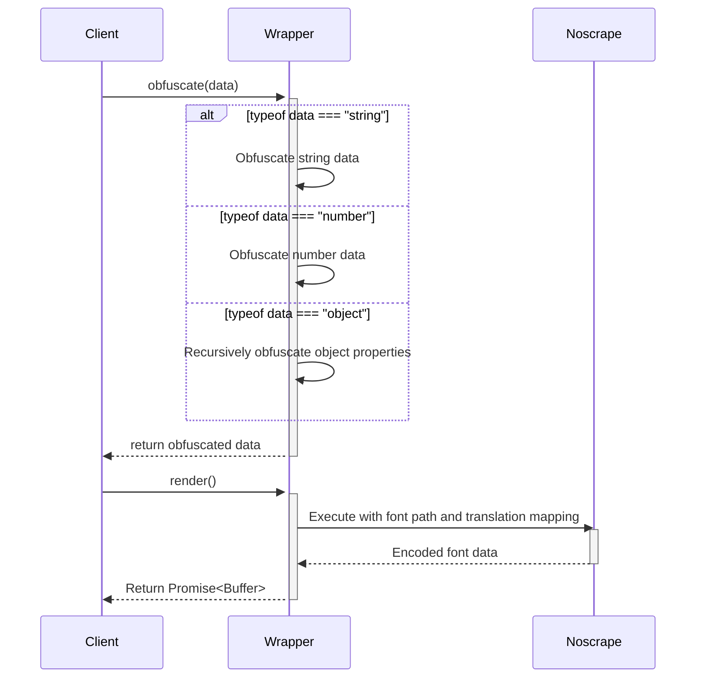

# noscrape

```mermaid
sequenceDiagram
    participant Client
    participant Wrapper
    participant Noscrape

    Client ->>+ Wrapper: obfuscate(data)
    activate Wrapper

    alt typeof data === "string"
        Wrapper ->> Wrapper: Obfuscate string data
    else typeof data === "number"
        Wrapper ->> Wrapper: Obfuscate number data
    else typeof data === "object"
        Wrapper ->> Wrapper: Recursively obfuscate object properties
    end
    Wrapper -->>- Client: return obfuscated data


    Client ->> Wrapper: render()
    activate Wrapper
    Wrapper ->> Noscrape: Execute with font path and translation mapping
    activate Noscrape
    Noscrape -->> Wrapper: Encoded font data
    deactivate Noscrape
    Wrapper -->> Client: Return Promise<Buffer>
    deactivate Wrapper

```